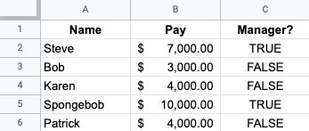
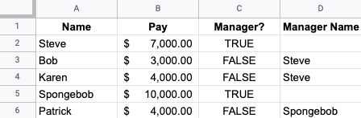
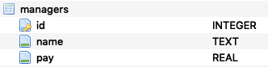
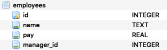
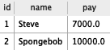
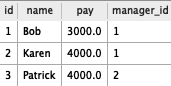

# SQL Table Relations - Introduction

## Introduction

Now that you've learned the fundamentals of writing SQL queries, it's time to level up! One of the most powerful aspects of SQL is their *relational* nature, meaning that they not only store data, they store relationships between different tables of data. In this section you will learn to use the `JOIN` clause and *subquery* concept to write queries that span multiple tables. Then at the end you will complete some SQL practice specifically intended to prepare you for the kinds of SQL questions you're likely to see in technical interviews.

## Relational Databases

You have already seen this image several times:


We also previously described the idea that each table has a **primary key** (indicated in the diagram above using `*`) and many tables have one or more **foreign keys** that link records in these tables to records in other tables.

But, why is it set up that way? What problem is it solving?

Let's walk through a case study to understand this better.

### Relational Databases - Payroll Case Study

Let's say that you've been hired by a big and important company to handle the payroll for all of their employees. Every two weeks, you need to look up each and every employee and how much they get paid. You need to send them a check *and* send a notice of that check to their manager. (They have a very flat hierarchy, where everyone is either a manager or a regular employee. Managers do not have managers and regular employees do not manage anyone.)

In addition, let's say that managers get paid every month, instead of every two weeks. So, once a month we need to go through the list of employees again, find just the managers, and send them their checks.

In such a situation, we would need a place to store information about all of the managers and employees. Using a spreadsheet, your storage system might look something like this:



This tells you *almost* everything you need, since it would allow you to filter who is a manager and who isn't, plus the payment amounts. But it doesn't have enough information for you to be able to send notices to employees' managers, since it just says who is an employee and who is a manager, but not the relationships.

One idea we might have is to add another column, so that every employee record also lists the name of their manager:



Now we technically have all of the information we need, but we can think of a few issues:

1. There is some redundancy and wasted space. We don't actually need the `Manager?` column, since we can just check whether there is a name in the `Manager Name` column...but maybe we don't want to remove that since accidentally putting a manager name in the wrong place could mark someone as a regular employee when they're actually a manager.
2. This is not a very robust system if anything changes. What if we get another manager who is also named Steve? Maybe you could enter the new Steve as "Steve H.", and you would just need to remember that "Steve" refers to the one who was there first.
3. Or, what if Steve decides he wants to rebrand himself and start going by Steven instead? (You can also think of other reasons why someone would change their legal name.) Then you would need to find all places in the spreadsheet that say "Steve" and replace them with "Steven".

If you really only had 5 total employees, it would be manageable to do this work "by hand" and just remember what you did. But if you had hundreds or thousands of employees, or you were working with a team of payroll professionals instead of by yourself, you can imagine how this system could get unmanageable pretty quickly!

#### The Relational Database Solution

We can use SQL to manage this information more effectively. First, we set up a managers table and an employees table with the following schemas:





Both the managers table and the employees table have primary keys (indicated by the key icon here) called `id`. Then employees have a foreign key called `manager_id` that links to a record in the managers table.

The same data shown above is entered in like this:





Now, the issues described before are no longer issues:

1. There is no redundancy or extra space. You know whether someone is a regular employee or a manager based on which table they are in, and managers don't have an extra empty field for a manager name.
2. If we get another manager named Steve, we can just add another record to the managers table. It will have an `id` of 3 and will not be confused with this Steve, who has an `id` of 1.
3. If Steve changes his name to Steven, you only need to change one value in one place: the `name` column in Steve's record in the managers table. No need to hunt down the same information stored in multiple places in order to edit it!

## SQL `JOIN`

The SQL `JOIN` clause is the main way that you will write queries that combine data from multiple tables.

Continuing with the example above, let's say we want to handle payroll for all regular employees. To do that, we need to know their name, pay, and manager name.

If we just `SELECT *` from the employees table, it will look like this:


```python
import pandas as pd
import sqlite3

conn = sqlite3.connect("payroll.db")
pd.read_sql("""SELECT * FROM employees;""", conn)
```


<div>
<style scoped>
    .dataframe tbody tr th:only-of-type {
        vertical-align: middle;
    }

    .dataframe tbody tr th {
        vertical-align: top;
    }

    .dataframe thead th {
        text-align: right;
    }
</style>
<table border="1" class="dataframe">
  <thead>
    <tr style="text-align: right;">
      <th></th>
      <th>id</th>
      <th>name</th>
      <th>pay</th>
      <th>manager_id</th>
    </tr>
  </thead>
  <tbody>
    <tr>
      <th>0</th>
      <td>1</td>
      <td>Bob</td>
      <td>3000.0</td>
      <td>1</td>
    </tr>
    <tr>
      <th>1</th>
      <td>2</td>
      <td>Karen</td>
      <td>4000.0</td>
      <td>1</td>
    </tr>
    <tr>
      <th>2</th>
      <td>3</td>
      <td>Patrick</td>
      <td>4000.0</td>
      <td>2</td>
    </tr>
  </tbody>
</table>
</div>


Then we could manually query for each manager `id`:


```python
pd.read_sql("""SELECT name FROM managers WHERE id = 1;""", conn)
```


<div>
<style scoped>
    .dataframe tbody tr th:only-of-type {
        vertical-align: middle;
    }

    .dataframe tbody tr th {
        vertical-align: top;
    }

    .dataframe thead th {
        text-align: right;
    }
</style>
<table border="1" class="dataframe">
  <thead>
    <tr style="text-align: right;">
      <th></th>
      <th>name</th>
    </tr>
  </thead>
  <tbody>
    <tr>
      <th>0</th>
      <td>Steve</td>
    </tr>
  </tbody>
</table>
</div>


```python
pd.read_sql("""SELECT name FROM managers WHERE id = 2;""", conn)
```


<div>
<style scoped>
    .dataframe tbody tr th:only-of-type {
        vertical-align: middle;
    }

    .dataframe tbody tr th {
        vertical-align: top;
    }

    .dataframe thead th {
        text-align: right;
    }
</style>
<table border="1" class="dataframe">
  <thead>
    <tr style="text-align: right;">
      <th></th>
      <th>name</th>
    </tr>
  </thead>
  <tbody>
    <tr>
      <th>0</th>
      <td>Spongebob</td>
    </tr>
  </tbody>
</table>
</div>


That works, but it's annoying. Again, you can imagine that not scaling well to hundreds or thousands of employees.

With a SQL join, we can do it all at once:


```python
q = """
SELECT *
FROM employees
JOIN managers
    ON employees.manager_id = managers.id
;
"""
pd.read_sql(q, conn)
```


<div>
<style scoped>
    .dataframe tbody tr th:only-of-type {
        vertical-align: middle;
    }

    .dataframe tbody tr th {
        vertical-align: top;
    }

    .dataframe thead th {
        text-align: right;
    }
</style>
<table border="1" class="dataframe">
  <thead>
    <tr style="text-align: right;">
      <th></th>
      <th>id</th>
      <th>name</th>
      <th>pay</th>
      <th>manager_id</th>
      <th>id</th>
      <th>name</th>
      <th>pay</th>
    </tr>
  </thead>
  <tbody>
    <tr>
      <th>0</th>
      <td>1</td>
      <td>Bob</td>
      <td>3000.0</td>
      <td>1</td>
      <td>1</td>
      <td>Steve</td>
      <td>7000.0</td>
    </tr>
    <tr>
      <th>1</th>
      <td>2</td>
      <td>Karen</td>
      <td>4000.0</td>
      <td>1</td>
      <td>1</td>
      <td>Steve</td>
      <td>7000.0</td>
    </tr>
    <tr>
      <th>2</th>
      <td>3</td>
      <td>Patrick</td>
      <td>4000.0</td>
      <td>2</td>
      <td>2</td>
      <td>Spongebob</td>
      <td>10000.0</td>
    </tr>
  </tbody>
</table>
</div>


Great, all of the information in one table!

Well, that has everything we want, plus some extra information. It's confusing that we have `name` and `pay` in there twice. Since we are trying to manage regular employee payroll, we probably only want the pay for those employees, and we should figure out a way to distinguish between the employee's name and the manager's name.

Most of the time when you have a `JOIN`, you want to specify which columns you actually want, instead of `SELECT *`. Something like this, using aliases to make everything really clear:


```python
q = """
SELECT
    employees.name AS employee_name,
    employees.pay AS employee_pay,
    managers.name AS manager_name
FROM employees
JOIN managers
    ON employees.manager_id = managers.id
;
"""
pd.read_sql(q, conn)
```


<div>
<style scoped>
    .dataframe tbody tr th:only-of-type {
        vertical-align: middle;
    }

    .dataframe tbody tr th {
        vertical-align: top;
    }

    .dataframe thead th {
        text-align: right;
    }
</style>
<table border="1" class="dataframe">
  <thead>
    <tr style="text-align: right;">
      <th></th>
      <th>employee_name</th>
      <th>employee_pay</th>
      <th>manager_name</th>
    </tr>
  </thead>
  <tbody>
    <tr>
      <th>0</th>
      <td>Bob</td>
      <td>3000.0</td>
      <td>Steve</td>
    </tr>
    <tr>
      <th>1</th>
      <td>Karen</td>
      <td>4000.0</td>
      <td>Steve</td>
    </tr>
    <tr>
      <th>2</th>
      <td>Patrick</td>
      <td>4000.0</td>
      <td>Spongebob</td>
    </tr>
  </tbody>
</table>
</div>


Perfect! Now we have a nice, maintainable system, *and* we are able to pull exactly the data needed for this task.

## SQL Subqueries

Another more-advanced technique we will introduce in this section is a SQL subquery. The above query, rewritten to use a subquery instead of `JOIN`, would be:


```python
q = """
SELECT
    name AS employee_name,
    pay AS employee_pay,
    (
        SELECT name
        FROM managers
        WHERE managers.id = employees.manager_id
    ) AS manager_name
FROM employees
;
"""
pd.read_sql(q, conn)
```


<div>
<style scoped>
    .dataframe tbody tr th:only-of-type {
        vertical-align: middle;
    }

    .dataframe tbody tr th {
        vertical-align: top;
    }

    .dataframe thead th {
        text-align: right;
    }
</style>
<table border="1" class="dataframe">
  <thead>
    <tr style="text-align: right;">
      <th></th>
      <th>employee_name</th>
      <th>employee_pay</th>
      <th>manager_name</th>
    </tr>
  </thead>
  <tbody>
    <tr>
      <th>0</th>
      <td>Bob</td>
      <td>3000.0</td>
      <td>Steve</td>
    </tr>
    <tr>
      <th>1</th>
      <td>Karen</td>
      <td>4000.0</td>
      <td>Steve</td>
    </tr>
    <tr>
      <th>2</th>
      <td>Patrick</td>
      <td>4000.0</td>
      <td>Spongebob</td>
    </tr>
  </tbody>
</table>
</div>


We will go over more details of both `JOIN` and subqueries in the following lessons.


```python
conn.close()
```

## Interview Practice

As mentioned previously, SQL is a very common topic in the technical interviews you will encounter as a junior data scientist. After introducing `JOIN` clauses and subqueries, this section will include a quiz covering SQL interview questions and a lab that features real-world interview questions pertaining to SQL and relational databases from major companies such as Facebook and Google!

## Summary

In the previous section, you learned about SQL fundamentals. In this section you will begin to dig into the *relational* aspect of SQL databases, and practice retrieving data from multiple tables at once. Then you will get some practice with the kinds of SQL questions that frequently appear in technical interviews.
